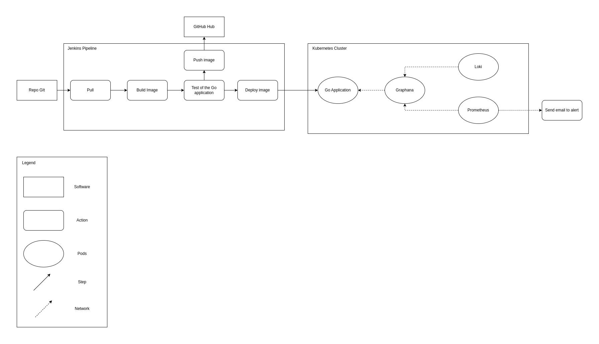
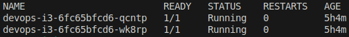
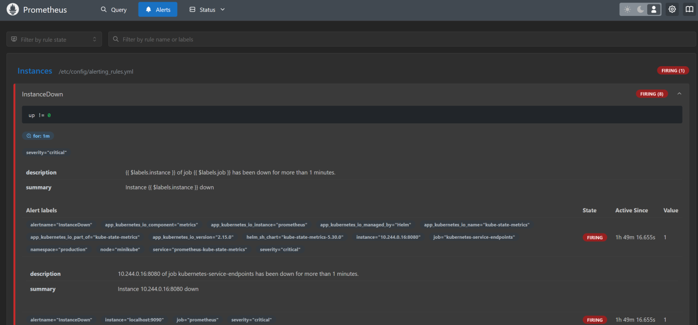
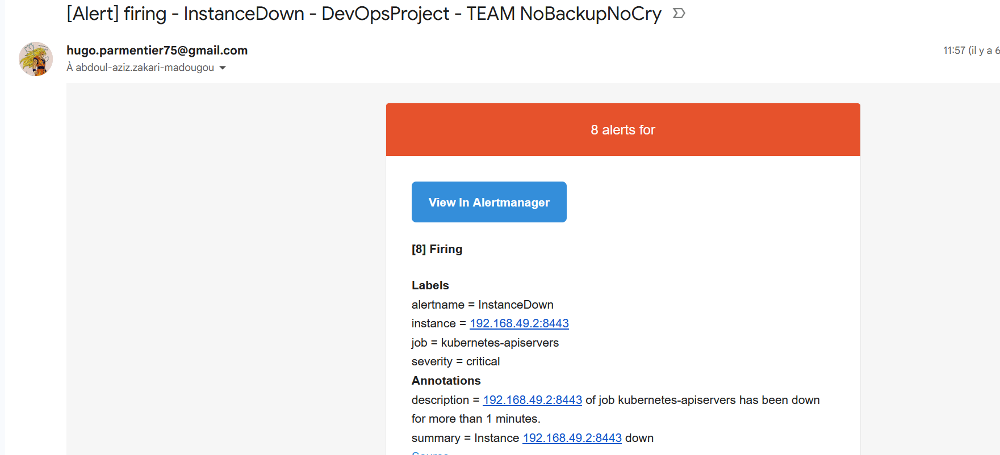
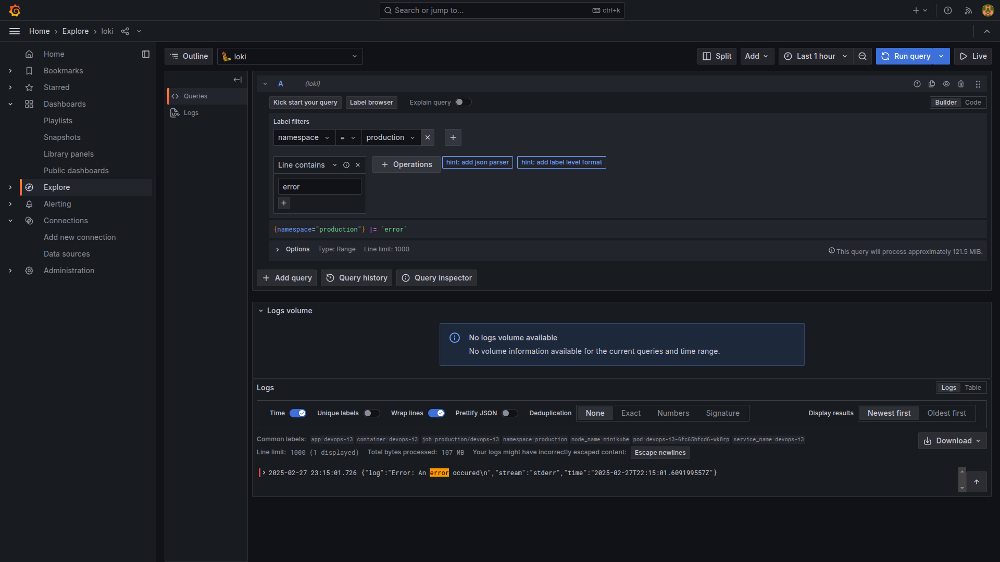
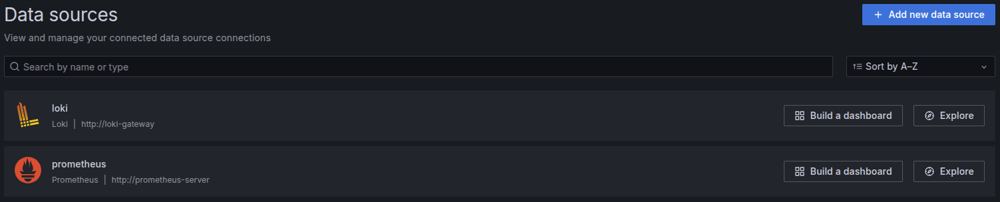
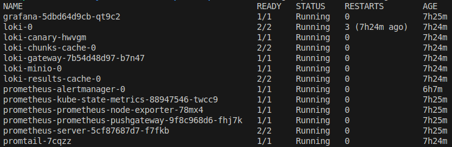

# Devops-I3

## Project Overview
This project focuses on deploying a Go-based application using Docker, Kubernetes, and Jenkins while integrating monitoring and log management tools such as Prometheus, Grafana, and Loki.

## Architecture Diagram
The following diagram illustrates the target architecture and toolchain for achieving continuous deployment of the application:  


## Repository Structure
```
/
├── k8s/               # Kubernetes deployment and service configurations
├── webapi/            # Go-based application source code
├── prometheus/        # Prometheus alerts and email configurations
├── loki/              # Loki configurations
├── Jenkinsfile        # CI/CD pipeline configuration for Kubernetes deployment
├── assets/            # Screenshots and diagrams related to deployment & monitoring
└── README.md          # Project documentation
```

## Application Deployment

### 1. The Application
- The application is retrieved from the following Git repository: [ST2DCE Project Repository](https://github.com/ST2DCE/project).
- The `/whoami` endpoint has been customized to display our team name: **No Backup No Cry**.

### 2. Kubernetes Deployment (Minikube)
The pipeline is configured to:
1. Build the Docker image.
2. Push it to Github container registry (GHCR).
3. Deploy the application in the **development** namespace from this image.
4. Perform a basic `curl` on the home endpoint to ensure no errors (e.g. code 200 returned).
5. If the test passes, deploy the application in the **production** namespace.
6. Pods have successfully been deployed in production:  


### 3. Buildpack
- The application was also built using [Buildpack](https://buildpacks.io/docs/tools/pack/).
- Our observations of pros and cons of Buildpack vs Dockerfile:

| Approach       | Pros                                                                    | Cons                                                        |
|----------------|-------------------------------------------------------------------------|-------------------------------------------------------------|
| **Buildpack**  | Simplifies build process by auto-detecting dependencies and environment | Less customizable compared to Dockerfile                    |
|                | Produces standardized and reproducible images                           | Can lead to large image sizes without optimizations         |
|                | No need for a Dockerfile, reducing complexity                           |                                                             |
| **Dockerfile** | Full control over image structure and dependencies                      | Requires manual maintenance and updates                     |
|                | Works with any application and technology stack                         | harder to configure                                         |

## Monitoring and Incident Management
All monitoring related applications and services have been put in a separate **monitoring** namespace.

### 1. Installing Prometheus & Grafana
- Installed via Helm:
```bash
helm repo add grafana https://grafana.github.io/helm-charts
helm install grafana grafana/grafana -n monitoring

helm repo add prometheus-community https://prometheus-community.github.io/helm-charts
helm install prometheus prometheus-community/prometheus -n monitoring
```
- Grabbed **Grafana dashboard** admin password:
```bash
kubectl get secret -n monitoring grafana -o jsonpath="{.data.admin-password}" | base64 --decode ; echo
```
- Configured **Prometheus Data Source** in Grafana with url `http://prometheus-server`.

### 2. Alert Manager Configuration
- Implemented an alert when a pod remains in a non-running state for over 1 minutes:
```bash
helm upgrade --reuse-values -f prometheus/alerts-rules.yaml prometheus prometheus-community/prometheus -n monitoring
```
- Alerts fired on **Prometheus Alert Manager**:  


### 3. Email Notifications
- Configured email alerts with the subject including the team name: **No Backup No Cry**:
```bash
helm upgrade --reuse-values -f prometheus/alertmanager-config.yaml prometheus prometheus-community/prometheus -n monitoring
```
- Example **Email Alert** fired:  


## Log Management with Loki
- Installed Loki using Helm:
```bash
helm install loki grafana/loki -f loki/values.yaml -n monitoring
```
- Configured **Loki Data Source** in Grafana with url `http://loki-gateway` and `X-Scope-OrgID` header set to `false`.
- Configured Promtail for log forwarding:
```bash
helm install promtail grafana/promtail \
--set "config.clients[0].url=http://loki-gateway/loki/api/v1/push" \
--set "config.clients[0].headers.X-Scope-OrgID=false" -n monitoring
```

### Query for Logs
- Created a Grafana query to filter logs containing the word **'error'** in the **production** namespace:  


## 4. Final Monitoring configuration
- **Both Data sources configured:**  

- **All monitoring pods:**  

