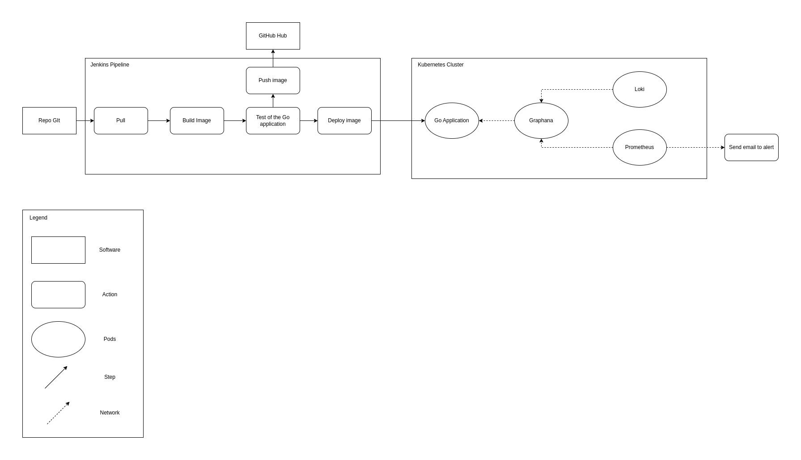
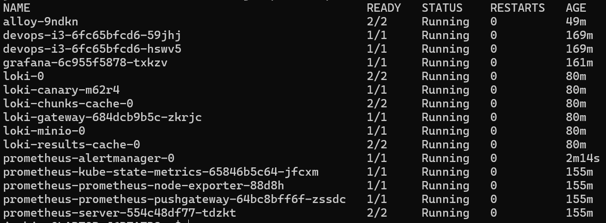
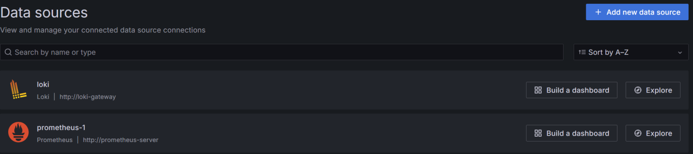
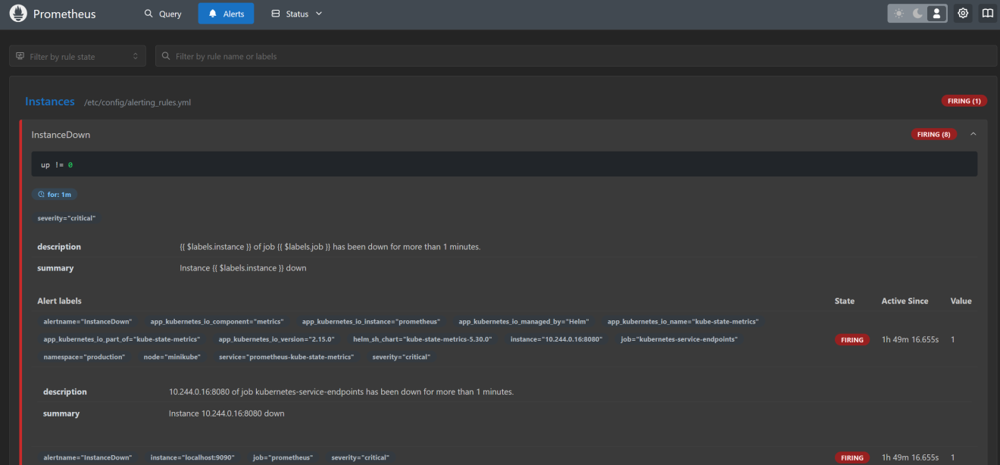
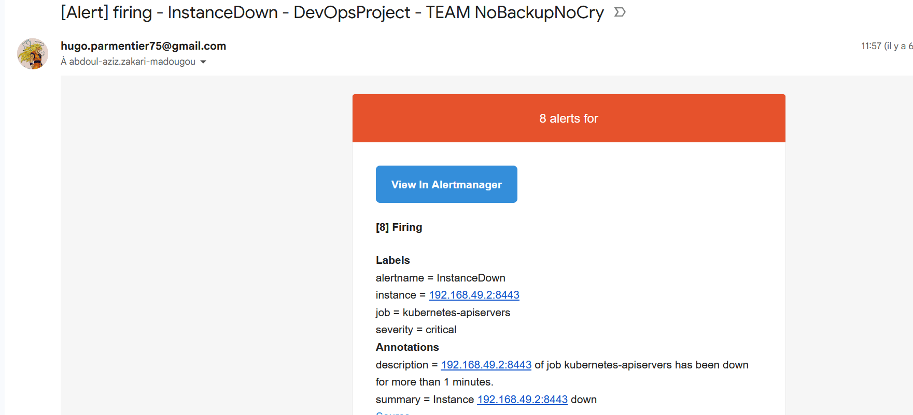

# ST2DCE-PRJ-2324S9-SE1

This is the diagram of our architecture: 

## Content

In the `k8s` folder, you can find the deployment and service configurations for the application located in the `webapi` folder.

At the root, you can find the `Jenkinsfile` used to deploy the application in a Kubernetes Cluster.

## Our Pods

As you can see there are the two pods named : `devops-i3` that represent the application itself

There are also the pods of `Grafana / Loki / Prometheus`

## Grafana & Prometheus

Here is the screen of the data source that we configured

Here is the screen of some alerts that we implemented on prometheus

You should have also received an email alert with our group name: No Backup No Cry.

## Loki

(Screenshot of Loki configured as a data source in Grafana)